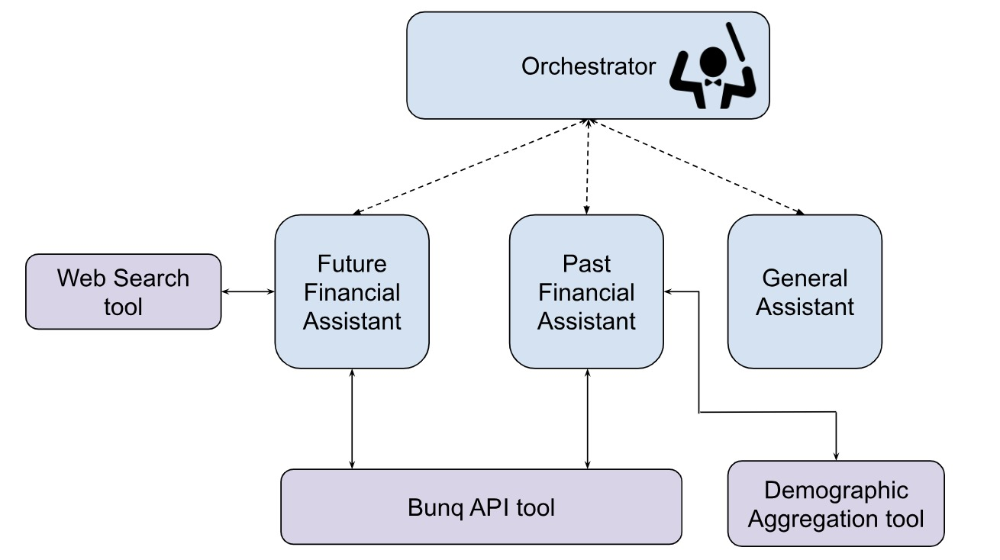

# bunq Hackathon - MPEW

A smart financial assistant that helps users analyze their spending patterns and make informed financial decisions.

## Features

- **Transaction Analysis**: Analyzes user spending patterns and provides insights
- **Financial Advice**: Offers personalized recommendations based on transaction history
- **Web Search Integration**: Searches for relevant financial information to support advice
- **Real-time Analysis**: Processes transactions as they occur
- **Smart Summaries**: Provides concise, actionable insights about spending habits

## Architecture overview

The system is built on a modular architecture that combines multiple AI agents and tools to provide personalised financial analysis. 




The system uses LangGraph to create a directed graph of operations, where each node represents a specific analysis task or tool. The Transaction Analysis Agent acts as the central coordinator, routing requests to appropriate tools and synthesizing responses.


## Components

- `transaction_agent.py`: Main agent for analyzing transactions and providing insights
- `user_transactions_tools.py`: Tools for processing and analyzing user transactions
- `web_search_tools.py`: Tools for searching and analyzing financial information
- `other_people_expenses_tools.py`: Tools for comparing user spending with peer groups and demographic data
- `tools.py`: Core tool definitions and integrations for all financial analysis components
- `app.py`: Main application entry point with FastAPI server and agent orchestration
- `agent.py`: Base agent class and configuration for all AI agents in the system
- `api_utils.py`: Utility functions for API interactions, data processing, and transaction extraction
- `user_transactions.json`: Sample transaction data for testing and development purposes


## Setup

1. Clone the repository
2. Install dependencies:
   ```bash
   pip install -r requirements.txt
   ```
3. Set up your environment variables:
   - `BUNQ_API_KEY`: Your bunq API key for transaction access
   - 'OPENAI_API_KEY': Key to the OpenAI platform

## Usage

The system processes transactions and provides insights through a conversational interface. Users can ask questions about their spending patterns and receive personalized advice.

Example queries:
- "What are my spending patterns?"
- "Can I afford a new laptop?"
- "How much do I spend on groceries compared to my peers?"

## Architecture

The system uses:
- LangGraph for agent orchestration
- LangChain for tool integration
- DuckDuckGo for web searches
- Custom transaction analysis tools

